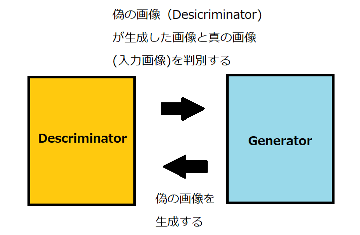

# gan_mnist

### GAN(Generative Adversarial Networks)

GANはgeneratorとdescriminatorという二つの
ネットワークを対決させることで、
画像生成しようというアプローチです。

図のようなモデルで学習していきます。  
generatorは画像を生成し、
descriminatorは画像が本物（入力画像）
か偽物（generatorが生成した画像）かを
判別します。
この二つのネットワークを競い合わせることで、
generatorはより入力画像に近い画像を生成する、
descriminatorは画像の真偽の判定の制度が向上する、
という感じで学習させます。
これにより、より入力画像と近い画像を生成できるようになります。

---
